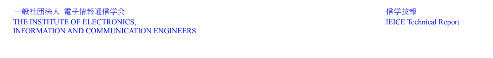
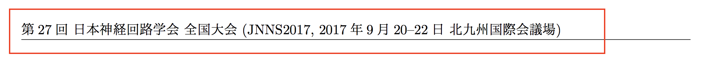
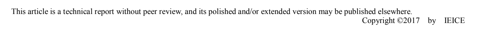
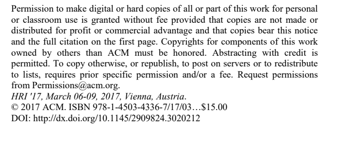
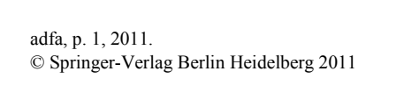

# 今井研究室　業績一覧

## 研究室メンバーへ
論文を提出した際は各自Jsonファイルに追記ください。

## draft_pdf_url
draft_pdf_url には、外部からフリーでアクセスできるURLを設定してください **(必須)** 。

論文がすでにフリーで公開されている場合は、そのURLを入れていただいて結構です。
* よくフリーで公開されている学会:
  * SIG-AGI
  * HAIシンポジウム
  * 人工知能学会
  
論文がフリーで公開されない場合は、学会名や著作権表示のないドラフト原稿を用意し、
今井研GoogleDriveの

[ailab > 2. Research Data > 論文ドラフト](https://drive.google.com/drive/folders/0B8j5f8TKRudITzQ5QWV2X0J4TWM?usp=sharing)

フォルダを適宜利用してアクセス可能なURLを入手してください。

* 学会名や著作権表示に関するNG例

## 注意
このリポジトリのデータは[Webサイト](https://imai-laboratory.github.io/webpage/#/publication)から参照されます。
Jsonフォーマットにエラーの無いようにお願いします。
ブラウザのキャッシュが強固なため、反映に時間のかかることがあります。

新しい年のファイルを追加した場合は`*_years.json`への追記もお願いします。
